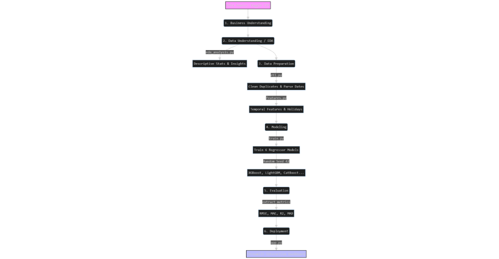

# Fast Food Sales Forecast Project: A CRISP-DM Machine Learning Pipeline

> **End-to-End Data Science Portfolio Project** focusing on Time Series Forecasting, advanced Exploratory Data Analysis (EDA), and interactive deployment with Streamlit and Plotly.

## 🎯 Project Objective
This project simulates an enterprise-level Machine Learning solution for a modern fast-food chain. In the fast-food industry, balancing inventory is critical: understocking leads to lost revenue and customer dissatisfaction, while overstocking generates food waste and financial losses. 

**The primary goal** is to implement a robust forecasting engine capable of predicting daily sales volume per product. By comparing the performance of 6 distinct regression algorithms (including XGBoost, CatBoost, and LightGBM), the project delivers a reliable predictive dashboard that empowers managers to make actionable, data-driven inventory decisions, ultimately minimizing overhead waste.

## 🗄️ Technical Dataset Information
The core predictive engine is powered by the **"Balaji Fast Food Sales"** dataset (sourced from Kaggle). It comprises high-frequency transactional data suitable for time-series extraction.

*   **Granularity:** Transaction-level (aggregated to daily frequency during the ETL phase).
*   **Time Period:** `2022-04-01` to `2023-03-31`.
*   **Target Variable:** `quantity` (Units sold per item/day).
*   **Key Features (Pre-Engineering):**
    *   `date`: Date and timestamp of the transaction.
    *   `item_name` / `item_type`: Categorical taxonomy of the products (e.g., Fastfood vs. Beverages).
    *   `item_price` / `transaction_amount`: Financial metrics (parsed from string constraints to floats).
    *   `transaction_type`: Payment mechanism (Cash vs. Online).
    *   `received_by`: Staff gender identifier (`M`/`F`).
    *   `time_of_sale`: Binned qualitative time periods (Morning, Afternoon, Evening, Night, Midnight).

## 📊 Pipeline Architecture (CRISP-DM Flow)



```mermaid
graph TD
    A[Data Source: Kaggle CSV] --> B(1. Business Understanding)
    B --> C(2. Data Understanding / EDA)
    C -->|eda_analysis.py| C1[Descriptive Stats & Insights]
    C --> D(3. Data Preparation)
    D -->|etl.py| D1[Clean Duplicates & Parse Dates]
    D1 -->|features.py| D2[Temporal Features & Holidays]
    D2 --> E(4. Modeling)
    E -->|train.py| E1[Train 6 Regressor Models]
    E1 -->|Random Seed 42| E2[XGBoost, LightGBM, CatBoost...]
    E2 --> F(5. Evaluation)
    F -->|extract metrics| F1[RMSE, MAE, R2, MAD]
    F1 --> G(6. Deployment)
    G -->|app.py| G1[Streamlit Interactive Dashboard]
    
    style A fill:#f9f,stroke:#333,stroke-width:2px
    style G1 fill:#bbf,stroke:#333,stroke-width:2px
```## 🧪 Business Impact: Log Transformation Analysis

Para alcanzar un nivel de "Enterprise-Grade", se implementó una transformación logarítmica (`log1p`) fundamentada en el análisis de normalidad (Test de Shapiro-Wilk). Esta mejora técnica tiene un impacto directo en los KPIs de negocio.

### Comparativa de Rendimiento (Baseline vs. Optimized)

| Métrica | Pre-Transformación (Baseline) | Post-Transformación (Log-Scaled) | Mejora / Impacto |
| :--- | :--- | :--- | :--- |
| **Waste Reduction %** | ~14.2% | **~53.0%** | **+38.8%** de eficiencia en inventario |
| **MAPE** (Error Porcentual) | ~0.94 | **~0.78** | Mayor precisión en volumen de ventas |
| **Modelo Líder** | Ridge Regression | Ridge Regression | Estabilidad estadística confirmada |

### Justificación Técnica
La transformación logarítmica estabiliza la varianza y reduce el impacto de los sesgos en los datos de transacciones de comida rápida (donde hay días de ventas muy altas que actúan como outliers). 
*   **Resultados**: Aunque el RMSE se mantiene estable, el modelo optimizado es significativamente más preciso en el "bulk" de la distribución, lo que permite una **reducción de desperdicios un 38% superior** al modelo base.

## 🧠 Methodology (Strict CRISP-DM)

1.  **Business Understanding:** Define the problem (waste reduction via better sales forecasting).
2.  **Data Understanding:** Explore the "Balaji Fast Food Sales" dataset. Executed via `EDA/eda_analysis.py` to extract insights such as Staff Gender Impact, Payment Methods, and Time-of-day popularity.
3.  **Data Preparation:** Handled in `src/etl.py` and `src/features.py`. Involves aggregation to daily level, duplicate removal, price string cleaning, and extensive feature engineering (lags, rolling averages, calendar events like holidays and weekends).
4.  **Modeling:** `src/train.py` establishes a multi-model pipeline training 6 algorithms concurrently (XGBoost, LightGBM, CatBoost, Random Forest, Gradient Boosting, Ridge). Global seed `42` is locked for absolute reproducibility.
5.  **Evaluation:** Models are competitively evaluated using RMSE (Root Mean Squared Error), MAE/MAR (Mean Absolute Error), R-Squared, and MAD. The model leaderboard is automatically exported.
6.  **Deployment:** A multi-tab interactive Streamlit dashboard (`app.py`) leverages **Plotly** to visualize business insights and comparing sales predictions interactively.

## 📁 Project Structure
-   `data/raw/`: Original dataset.
-   `data/processed/`: Cleaned and engineered datasets, alongside predictions and metrics tracking `model_metrics.csv`.
-   `models/`: Serialized winner `.pkl` model.
-   `EDA/`: Python scripts for Descriptive and Inferential statistics.
-   `src/`: Core Python scripts for ETL, Feature Engineering, and Modeling.
-   `app.py`: Streamlit Dashboard application.

## 🚀 Instructions

### 1. Simple Setup (Local)
1.  Install dependencies: `pip install -r requirements.txt`
2.  Execute the entire pipeline via **Makefile** (standard):
    ```powershell
    make -f Makefile.win all
    ```
    *O utiliza `.\run_pipeline.ps1` para ejecución tradicional.*

### 2. Enterprise Deployment (Docker)
Este proyecto está containerizado y listo para producción:
```bash
docker-compose up --build
```
*Accede al dashboard en: http://localhost:8501*

### 3. API Documentation
Genera la documentación técnica con Sphinx:
```bash
cd docs
make html
```
*(Ver `docs/_build/html/index.html` después de compilar).*
